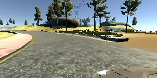
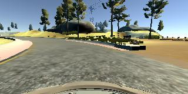
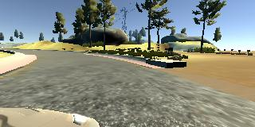

# self-driving
## Введение
Изначально планировалось одной более сложной задачи по предсказанию положения объектов в пространстве, но в ходе работы мы столкнулись с рядом трудностей и решили немного переформалировать задачу, оставаять в той же предметной области.

## Постановка задачи
[Udacity self-driving simulator](https://github.com/udacity/self-driving-car-sim) - симулятор настояшего автомобиля, в котором можно как самостоятельно двигаться по трассе, так и передавать управление созданной модели. Мы хотим непосредственно создать модель на основе глубокого обучения, которая будеть управлять автомобилем в симуляторе (газ, тормоз, руль).

## Данные
Для обучения модели берутся данные с 3 камер на автомобиле: передня и 2 боковые (center_....jpg, left_....jpg, right_....jpg). Изображения берутся из обучаюших пробегов: машина управляется вручную, сессия сохраняется в виде последовательности картинок. Изображения расположены в папке [data](data).

Пример изображений из обучающей выборки для левой, центральной и правой камер соответственно:

Мы для обучения будем использовать изображения только с центральной камеры.

## Модель
В качестве модели была взята `RezNet 18`. Дополнительно мы добавлили несколько полносвязных слоёв с активацией `relu`.

## Взаимодействие с симулятором

Для начала необходимо запустить [симулятор](https://github.com/udacity/self-driving-car-sim), он выступает в роли клиента, которые будет ждать указания сервера. Далее необходимо выбрать сцену и нажать `Autonomous Mode`. После чего запустить непосредственно модель.

На данный момент наша модель обучается, работает, но есть трудности с тем, чтобы скормить её симулятору.

## Постановка задачи (outdated)
Суть задачи заключается в предсказании какого-то количества (50) последующих состояний объектов в пространстве. Важно это потому, что нам необходимо заранее просчитывать маршрут беспилотника и, соответственно, порядок действий (газ, тормоз, руль…). Кроме этого, возможно, появится возможность предсказывать критические ситуации, например, аварии других агентов в движении, вылетающего на дорогу велосипедиста и так далее, для чего тоже требуется принятие своевременных действий.

Данные представлены в формате `l5kit`, что подразумевает, что у нас есть 4 вида данных:
 - `scenes`: данные, полученные с самого беспилотника (с его приборов), состоит из frame-ов
 - `frame`: данные представляют всю информацию с привязкой ко времени, состоит из таймстампа, информации об АМ (угол, положение), ссылки на остальные объекты движения (agents) и ссылки на информацию о светофорах
 - `agent`: сущность, видимая беспилотником, помечается лэйблом (велосипед, машина движется, машина стоит, не имеет значения  и т. д.)
 - `tl_faces`: динамическая информация о светофорах, их свете и состоянии
Физически датасет представляет _.zarr_ архив с огромным количеством данных. _Zarr_ формат выбран для того, чтобы была возможность пользоваться частью данных, чтобы не перегружать стек, так как данные достаточно объёмные, в numpy есть для этого инструменты. Датасет разделён на _test, valid, train_ (остальные являются вспомогательными и не обязательны для решения). Также на данные накладывается маска, чтобы использовать только релевантные для обучения данные. Кроме этого, авторы предлагают получить приватную часть данных, которая в 10 раз больше представленной публично. 

Сами файлы по структуре представляют координаты на плоскости, упорядоченные _x1,y1,x2,y2…_ В качестве решения предлагается представить следующие 50 пар координат во времени для конкретного объекта. Можно представить 2 вида решения: один наиболее вероятные сценарий, либо несколько (3) с указанием вероятности каждого.

## Описание решения (outdated)

В решении мы используем остаточную сеть ResNet, так как она сходиться быстрее аналогов и показывает нормальные перфоманс в анализе изображений. ResNet предобученa на датасете ImageNet (так как мы не располагаем достаточными ресурсами для самостоятельного обучения сетки).

Первый и последний слои сети заменены под ввод. В итоге мы закопались с данными и ничего не вышло🥲
